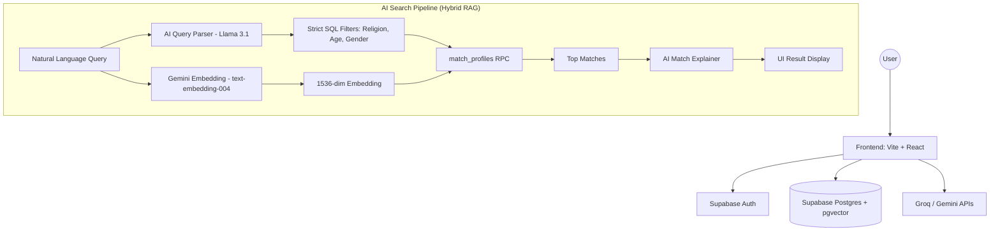

# Architecture: AI Matchmaking & RAG System

This document outlines the technical architecture of the AI-driven matrimonial platform, focusing on the Hybrid RAG (Retrieval-Augmented Generation) system.

## 🏗 High-Level Architecture

The platform combines traditional SQL relational data with modern Vector Search and LLM-based reasoning.

## 🧠 The RAG & Hybrid Search System

Our system uses a **Hybrid Search** approach to ensure both semantic relevance and strict preference matching.

### 1. Vector Search (Semantic)
Every profile is converted into a high-dimensional vector (1536 dimensions) using Google's `text-embedding-004`.
- **Fields included**: Bio, Profession, Religion, Hobbies, Habits, Physical Attributes, and Personality Prompts.
- **Why?**: This allows the system to find "vibe-based" matches (e.g., "someone who loves slow mornings and reading") that a keyword search would miss.

### 2. Hybrid Filtering (Strict)
Because vector search is "fuzzy," it can sometimes suggest matches with the wrong religion or gender. We solve this by using an LLM to parse the user's natural language query into **Strict Filters**:
- If a user types *"Muslim girl who loves to travel"*, the system extracts:
    - `religion`: "Muslim"
    - `gender`: "female"
- These are passed as strict `WHERE` clauses in the Postgres RPC before performing the vector similarity sort.

### 3. Match Explanation (Augmentation)
Once the results are retrieved, the top matches are sent to an LLM (Llama 3.1 via Groq) along with the original user query. 
- The AI explains **WHY** these people are good matches.
- This creates a conversational, personalized experience that feels like a human matchmaker.

## 🔄 Data Lifecycle & Synchronization

### Auto-Embedding Trigger
We use a PostgreSQL trigger `trg_flag_profile_needs_embedding`.
- Whenever a user updates a relevant field (Bio, Religion, etc.), the `needs_embedding` flag is set to `true`.
- A background process (or local check) then regenerates the vector to ensure the search index is always up-to-date.

### pgvector HNSW Index
To ensure lightning-fast searches even with thousands of users, we use an **HNSW (Hierarchical Navigable Small World)** index on the `embedding` column.
- This allows for approximate nearest neighbor (ANN) search in logarithmic time.

## 🛡 Security & Privacy
- **RLS (Row Level Security)**: Ensures users can only edit their own data.
- **Blocked Users**: The `match_profiles` RPC automatically excludes users who have blocked each other or were blocked by the current user.
