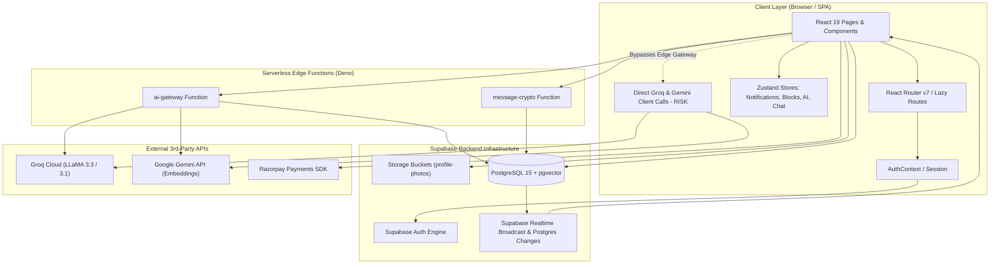
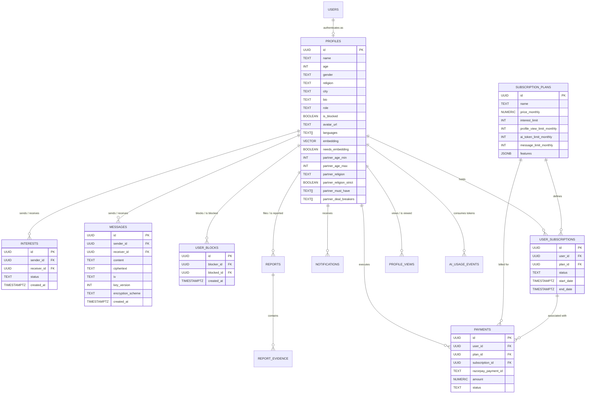
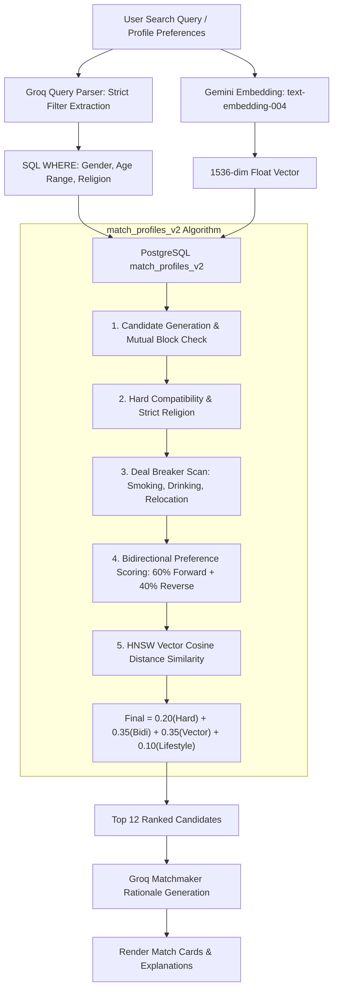
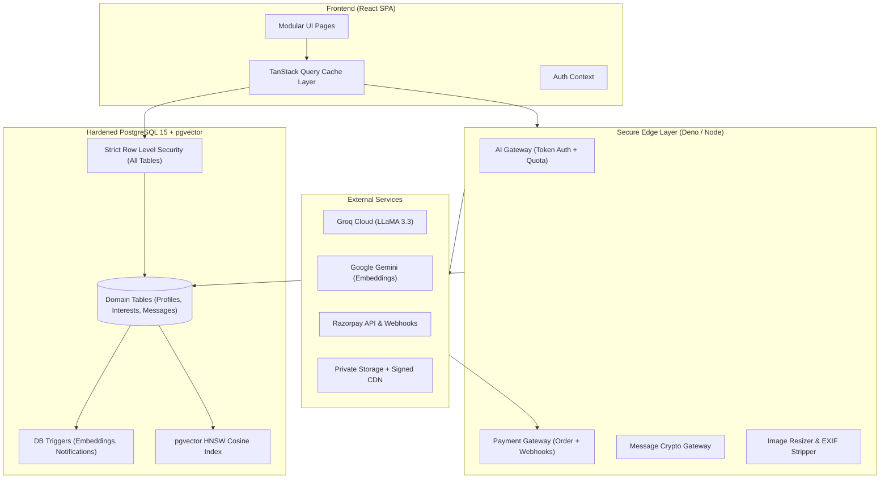
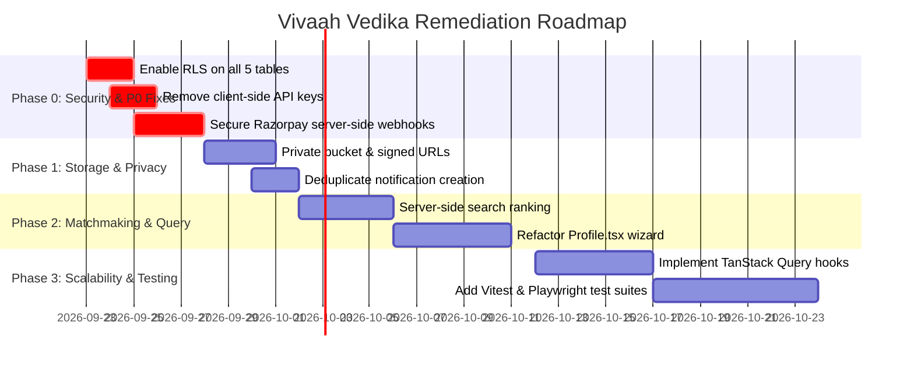

# MATRIMONIAL PLATFORM — FULL-STACK ARCHITECTURAL & SECURITY DEEP-DIVE AUDIT
**Platform:** Vivaah Vedika (Codebase: `mat2.0`)  
**Audit Scope:** Full-Stack Technical, Architectural, Product, UX/UI, Database, AI/RAG, Security, Performance, Scalability, and Domain Integrity Audit  
**Auditor Roles:** Principal Software Architect, Senior Full-Stack Engineer, Database Architect, Security Engineer, AI/RAG Architect, Performance & DevOps Engineer  
**Date:** September 2026  
**Status:** Complete Empirical Audit  

---

## Executive Summary

Vivaah Vedika (`mat2.0`) is a modern, full-stack, AI-augmented matrimonial web platform designed for matchmaking, structured profile discovery, bidirectional preference alignment, real-time encrypted messaging, and tiered monetization.

### System Strengths
1. **Rich Domain Modeling:** 40+ structured attributes capturing identity, values, personality, physical traits, lifestyle, and bidirectional partner preferences.
2. **Advanced Hybrid Vector Math (`match_profiles_v2`):** Sophisticated PostgreSQL RPC combining hard filters, bidirectional preference weighting, cosine vector distance (1536 dims), lifestyle scores, and strict deal-breaker penalties.
3. **Recoverable E2E Message Encryption:** AES-256-GCM encryption with dynamic IV, versioned key material, and audit trails.
4. **Curated Aesthetic:** Premium matrimonial design system built on Tailwind CSS, Radix UI primitives, Lucide icons, and responsive layouts.

### Critical Vulnerabilities & High Risks (P0 / P1 Summary)
1. **Critical Security Flaw — Missing Row Level Security (RLS):** 5 core tables (`messages`, `interests`, `user_blocks`, `user_subscriptions`, and `subscription_plans`) **lack RLS protection**. Any authenticated user can read all private messages, view mutual blocks, or manipulate subscriptions directly.
2. **Critical Security Flaw — Client-Side Payment Verification & Free Subscription Spoofing:** Razorpay checkout is driven purely by the browser with simulated test fallback. Subscriptions are directly inserted into `user_subscriptions` by the client without server-side webhook signature verification.
3. **Severe AI Security Flaw — Leaked Production API Keys in Client Bundle:** `VITE_GROQ_API_KEY` and `VITE_GEMINI_API_KEY` are embedded in the frontend bundle, allowing direct client calls that bypass the edge gateway and quota enforcement.
4. **Data Isolation & Media Leakage:** The `profile-photos` storage bucket is set to `public = true`. Avatars and social media links are visible via direct queries, bypassing frontend blur gates.
5. **Architectural Duplication:** Duplicate matchmaking scoring, notification generation, and quota checks between SQL stored procedures and client TypeScript.

---

## 1. Technology Stack Inventory

| Technology | Version | Purpose | Where Used | Why It Is Used | Dependencies | Potential Issues | Replacement Needed? | Reason |
| :--- | :--- | :--- | :--- | :--- | :--- | :--- | :---: | :--- |
| **React** | `19.2.4` | Frontend UI runtime | Core application (`src/main.tsx`) | Component hierarchy & DOM rendering | `@types/react`, `react-dom` | High ecosystem velocity; React 19 compatibility with older libraries | **NO** | Core foundation is modern |
| **Vite** | `8.0.4` | Build tool & Dev server | Project bundler (`vite.config.ts`) | Fast HMR, ESM bundling | `@vitejs/plugin-react` | None | **NO** | Fast and standard |
| **TypeScript** | `~6.0.2` | Static typing | Whole frontend & edge functions | Type safety across domain models | Node types | Version definition uses experimental tag; loose types (`any`) in key hooks | **NO** | Standardize tsconfig & eliminate `any` |
| **Supabase JS** | `2.39.3` | DB, Auth, Realtime client | `src/lib/supabaseClient.ts`, stores, pages | Backend-as-a-Service integration | Fetch API | Heavy reliance on direct client queries creates security surface | **NO** | Keep client, but enforce strict RLS & server routes |
| **Tailwind CSS** | `3.4.1` | Utility-first CSS | `src/index.css`, UI components | Design tokens, responsive layouts | `postcss`, `autoprefixer` | Verbose JSX class strings | **NO** | Industry standard |
| **Radix UI** | `^1.0 - ^2.2` | Accessible headless UI | `src/components/ui/*` | Dialogs, dropdowns, tabs, popovers | React | Multiple unpinned sub-packages | **NO** | Solid accessibility base |
| **Zustand** | `5.0.12` | Client state management | `src/stores/*` | Notification, block, chat, and AI state | None | State fragmentation across stores | **NO** | Performant and lightweight |
| **TanStack Query**| `5.17.15` | Server state management | `src/App.tsx` | Query client initialization | React | Underutilized (most pages manually use `useEffect` + `useState`) | **NO** | Refactor pages to use Query hooks |
| **Google GenAI** | `0.24.1` | Multimodal / Embeddings | `supabase/functions/ai-gateway`, `src/lib/ai.ts` | 1536-dim vector embeddings | `@google/generative-ai` | `gemini-embedding-001` used; client-side bundle leakage | **PARTIAL** | Move strictly behind backend gateway; upgrade to `text-embedding-004` |
| **Groq API** | REST | Fast LLM Inference | `ai-gateway`, `src/lib/ai.ts` | Filter extraction, profile optimization, explanations | LLaMA 3.3 70B / 8B | Deprecated models in fallback list (`llama3-8b-8192`), client key leak | **NO** | Secure keys server-side only; standardize model identifiers |
| **pgvector** | Extension | Vector database & search | Supabase PostgreSQL (`profiles.embedding`) | HNSW index similarity search | PostgreSQL | 1536 dimensions; missing index on active/blocked status composite | **NO** | Excellent for scalable vector operations |
| **Razorpay** | Checkout JS | Payment Gateway | `src/lib/razorpay.ts`, `src/pages/Subscription.tsx` | Indian credit cards, UPI, netbanking | Dynamic `<script>` tag | No backend order generation; client mock fallback spoofing | **YES (Refactor)** | Implement server-side Orders API + Webhook signature verification |
| **Date-fns** | `3.6.0` | Date manipulation | Timestamps, chat grouping | Date formatting and relative time | None | None | **NO** | Reliable utility |
| **Sonner & Toast**| `2.0.7` | UI Notifications | User feedback toasts | Dual toast systems in codebase | React | Redundant toast libraries (`@/hooks/use-toast` vs `sonner`) | **YES (Consolidate)**| Standardize on `sonner` |

---

## 2. Repository Architecture & File Mapping

```text
mat2.0/
├── .env.example                          # Environment variable specifications
├── backfill-embeddings.js                # Offline batch worker for missing embeddings
├── create-generic-admin.js               # CLI script to bootstrap administrator accounts
├── seed-50-users.js                      # Realistic seed script for user pool
├── supabase/
│   ├── config.toml                       # Supabase CLI configuration
│   ├── supabase-setup.sql                # Monolithic production database definition
│   ├── functions/
│   │   ├── _shared/cors.ts               # Shared CORS & JSON response helpers
│   │   ├── ai-gateway/index.ts           # Deno Edge Function for Gemini & Groq proxy
│   │   └── message-crypto/index.ts       # Deno Edge Function for AES-256-GCM encryption
│   └── migrations/                       # Incremental SQL migration scripts (20260915 - 20260918)
├── src/
│   ├── main.tsx                          # App bootstrapping & DOM mounting
│   ├── App.tsx                           # BrowserRouter, ProtectedRoute, Route Preloaders
│   ├── index.css                         # Design system tokens, root variables, animations
│   ├── types/index.ts                    # Global TypeScript domain definitions
│   ├── context/
│   │   └── AuthContext.tsx               # Supabase Auth lifecycle & active profile provider
│   ├── hooks/
│   │   ├── use-mobile.tsx                # Viewport breakpoint detection
│   │   ├── use-toast.ts                  # Legacy UI toast hook
│   │   ├── useAiAccess.ts                # Plan check & AI token quota listener
│   │   └── usePlanEntitlements.ts        # Client-side subscription feature flags
│   ├── stores/
│   │   ├── useAiStore.ts                 # AI search query & result cache
│   │   ├── useBlockStore.ts              # Mutual user block cache
│   │   ├── useChatStore.ts               # Active chat session pointer
│   │   └── useNotificationStore.ts       # Real-time notification store & sync loop
│   ├── lib/
│   │   ├── ai.ts                         # AI client invoker & Groq/Gemini fallbacks
│   │   ├── matchmaking.ts                # Client-side bidirectional compatibility math
│   │   ├── messageCrypto.ts              # Client crypto bridge to edge function
│   │   ├── profileEmbedding.ts           # 2D embedding document builder
│   │   ├── profileJourney.ts             # Profile completion & relationship status helpers
│   │   ├── razorpay.ts                   # Razorpay modal invoker & mock fallback
│   │   ├── supabaseClient.ts             # Initialized Supabase JS client
│   │   └── usageLimits.ts                # Client helper for profile views & message quotas
│   ├── components/
│   │   ├── ui/                           # 25+ shadcn/radix UI primitives
│   │   ├── AdminSubscribers.tsx          # Subscriber table & billing overview
│   │   ├── AdminSubscriptions.tsx        # Plan creation & limit editor
│   │   ├── AiUsageStatus.tsx             # Visual progress bar for monthly token consumption
│   │   ├── AuthSplitLayout.tsx           # Split view for login/signup/profile wizard
│   │   ├── BlockedUsersList.tsx          # Block management drawer
│   │   ├── ChatConversationPanel.tsx     # Chat messages & composer layout
│   │   ├── CustomSidebar.tsx             # Nav bar with notification counts & badges
│   │   ├── Layout.tsx                    # Application shell with responsive sidebar
│   │   ├── NotificationBell.tsx          # Real-time bell popover with unread counter
│   │   ├── PaginationControls.tsx        # Server/client pagination buttons
│   │   ├── PartnerPreferencesMatch.tsx   # Visual compatibility checklist breakdown
│   │   ├── ProfileCard.tsx               # Member discovery card with photo & match chips
│   │   ├── ReportDialog.tsx              # Abuse reporting modal with message evidence
│   │   └── UserAvatar.tsx                # Fallback avatar with Dicebear generator
│   └── pages/                            # 14 routed views (Browse, Profile, AiMatch, etc.)
```

---

## 3. Current System Architecture



---

## 4. Complete User Journey Audit

| Step | Screen | Action | API / RPC Call | DB Tables Touched | Client State | Validation Rules | Failure Modes & Gaps |
| :--- | :--- | :--- | :--- | :--- | :--- | :--- | :--- |
| **1. Visitor** | `Landing.tsx` | Browse features, testimonials, plans | None (Static) | None | Unauthenticated | None | None |
| **2. Registration**| `Signup.tsx` | Submit email & password | `supabase.auth.signUp()` | `auth.users` | `loading`, `emailSent` | Password $\ge$ 6 chars, password confirmation match | No phone verification or captcha; rate limit handled by Supabase |
| **3. Profile Creation**| `Profile.tsx` | 6-step wizard: Basic info, lifestyle, values, physical, prompts, partner preferences | `supabase.from('profiles').insert()` & `generateEmbedding()` | `profiles`, `storage.objects` | `form`, `currentStepIndex`, `avatarPreview` | Name, Age (18–100), Gender, Religion, City required | Massive 1500-line single file; embedding generation blocks submission |
| **4. Discovery** | `Browse.tsx` | Filter by age, city, religion, profession; smart sort | `supabase.from('profiles').select()` & `interests`, `user_blocks` | `profiles`, `interests`, `user_blocks` | `filters`, `profiles`, `profileRelations`, `savedProfiles` | Debounced filter parameters | **Client-side sorting on 12 paged items only**; pagination drift from blocked filtering |
| **5. AI Match** | `AiMatch.tsx` | Natural language search prompt | `parseSearchFilters`, `generateEmbedding`, `match_profiles_v2`, `generateMatchExplanation` | `profiles`, `ai_usage_events`, `user_blocks` | `query`, `matches`, `aiExplanation`, `isSearching` | Non-empty prompt string; plan entitlement gate | Executes 2 LLM inferences and 1 embedding sequentially; re-fetches on page change |
| **6. Send Interest**| `UserProfile.tsx` | Click "Send Interest" | `supabase.from('interests').insert()` & `createNotification()` | `interests`, `notifications` | `interest`, `sending` | Block relation check, active block check | **Duplicate notifications created** (Trigger + Client Store call); no DB-enforced limit |
| **7. Respond Interest**| `Interests.tsx` | Accept or Reject request | `supabase.from('interests').update({ status })` | `interests`, `notifications` | `received`, `sent` | Only receiver can update status | No RLS on `interests` table allows unauthorized updates via script |
| **8. Realtime Chat**| `Chat.tsx` | Send message | `message-crypto` (encrypt) $\rightarrow$ `supabase.from('messages').insert()` $\rightarrow$ Realtime broadcast | `messages`, `notifications`, `user_subscriptions` | `messages`, `newMessage`, `connected` | Mutual interest `accepted`, message monthly limit check | **No RLS on `messages` table**; message limit check enforced only on client |
| **9. Subscription Upgrade**| `Subscription.tsx` | Select plan, open Razorpay modal | `openRazorpayCheckout()` $\rightarrow$ `supabase.from('user_subscriptions').insert()` | `user_subscriptions`, `payments`, `subscription_plans` | `activeSub`, `isProcessing`, `billingCycle` | Plan selection | **Client inserts subscription directly**; mock success fallback allows free access |
| **10. Account Safety**| `UserProfile.tsx` | Block or Report User | `supabase.from('user_blocks').insert()`, `supabase.from('reports').insert()` | `user_blocks`, `reports`, `report_evidence` | `blockDialogOpen`, `reportDialogOpen` | Cannot report/block self; mandatory reason string | `user_blocks` lacks RLS |
| **11. Admin Moderation**| `Admin.tsx` | View users, block accounts, dismiss reports, edit plans | `supabase.from('profiles').update()`, `subscription_plans` CRUD | `profiles`, `reports`, `user_blocks`, `subscription_plans` | `users`, `reports`, `blocks`, `interests` | Admin role verified on client & query | **Admin DELETE/UPDATE on profiles fails under standard RLS** without security definer function |

---

## 5. Frontend Architecture Audit

### Component Hierarchy
* `App.tsx` configures routing, lazy loading with preloading heuristics, and global providers (`QueryClientProvider`, `AuthProvider`, `TooltipProvider`).
* `Layout.tsx` wraps all authenticated pages, rendering the desktop sidebar (`CustomSidebar.tsx`), mobile bottom bar, and `NotificationBell.tsx`.
* Individual feature pages are rendered inside `<ProtectedRoute>`.

### Identified Anti-Patterns
1. **Monolithic Wizard (`Profile.tsx` - 1,501 lines):** Combines form state management for 40+ attributes, tag arrays, image uploads, AI document compilation, and database calls in one file.
2. **State Fragmentation:** Notifications are tracked across `useNotificationStore`, `CustomSidebar`, and realtime postgres subscriptions.
3. **Underutilized React Query:** Direct `useEffect` data fetching loops are used across `Browse.tsx`, `Chat.tsx`, and `Admin.tsx` instead of declarative Query hooks.

---

## 6. UX/UI & Design System Audit

* **Typography:** Serif headings (`font-serif`, Playfair Display / Cinzel) with clean sans-serif UI typography.
* **Color System:** Primary Rose Red (`#e11d48`, `hsl(346, 77%, 49%)`), Gold secondary badges, deep slate dark-mode tokens.
* **Matrimonial Safety & Trust:** Visual preference alignment matrix (`PartnerPreferencesMatch.tsx`), prominent reporting dialog with message evidence attachment, profile completeness indicators.
* **UX Gaps:** Paywall blurring of photos and social presence is purely cosmetic on the client; raw URLs exist in the DOM.

---

## 7. Backend Architecture Audit

### Supabase Edge Functions
1. **`ai-gateway` (`supabase/functions/ai-gateway/index.ts`):**
   * Actions: `generateEmbedding`, `generateProfileOptimization`, `generateMatchExplanation`, `parseSearchFilters`.
   * Enforces monthly token quotas via `record_ai_usage` RPC.
   * Direct Groq LLaMA 3.3/3.1 and Gemini API integration.
2. **`message-crypto` (`supabase/functions/message-crypto/index.ts`):**
   * Actions: `encrypt`, `decrypt`.
   * AES-256-GCM symmetric encryption with 12-byte random IV.
   * Decryption restricted to conversation participants or administrators with audit logs in `message_decryption_audit`.

---

## 8. Database Deep-Dive Audit

### Complete Database Schema Inventory

| Table | Purpose | PK | Foreign Keys | Indexes | RLS Status |
| :--- | :--- | :--- | :--- | :--- | :---: |
| `profiles` | User profile & vector embedding | `id (UUID)` | `auth.users(id)` | `gender`, `religion`, `city`, `embedding (hnsw)`, `needs_embedding` | **ENABLED** |
| `interests` | Connection requests | `id (UUID)` | `sender_id`, `receiver_id` $\rightarrow$ `profiles` | `sender_id`, `receiver_id` | **DISABLED (CRITICAL)** |
| `messages` | Encrypted chat records | `id (UUID)` | `sender_id`, `receiver_id` $\rightarrow$ `profiles` | `(sender_id, receiver_id)` | **DISABLED (CRITICAL)** |
| `user_blocks` | Block registry | `id (UUID)` | `blocker_id`, `blocked_id` $\rightarrow$ `profiles` | `(blocker_id, blocked_id)` (Unique) | **DISABLED (CRITICAL)** |
| `reports` | Abuse reports | `id (UUID)` | `reporter_id`, `reported_user_id` $\rightarrow$ `profiles` | `status` | **ENABLED** |
| `report_evidence`| Attached message snapshots | `id (UUID)` | `report_id` $\rightarrow$ `reports` | `report_id` | **ENABLED** |
| `notifications` | In-app alerts | `id (UUID)` | `user_id` $\rightarrow$ `profiles` | `user_id` | **ENABLED** |
| `subscription_plans`| Plan configurations & quotas | `id (UUID)` | None | None | **DISABLED (CRITICAL)** |
| `user_subscriptions`| User plan subscriptions | `id (UUID)` | `user_id` $\rightarrow$ `profiles`, `plan_id` $\rightarrow$ `subscription_plans` | `user_id` | **DISABLED (CRITICAL)** |
| `payments` | Transaction records | `id (UUID)` | `user_id`, `plan_id`, `subscription_id` | `user_id`, `razorpay_payment_id` | **ENABLED** |
| `profile_views` | View quota tracker | `id (UUID)` | `viewer_id`, `viewed_user_id` $\rightarrow$ `profiles` | `(viewer_id, month_bucket)` | **ENABLED** |
| `ai_usage_events`| Token accounting | `id (UUID)` | `user_id` $\rightarrow$ `profiles` | `(user_id, month_bucket)` | **ENABLED** |
| `message_decryption_audit`| Decryption access log | `id (UUID)` | `requested_by`, `approved_by` $\rightarrow$ `profiles` | None | **ENABLED** |

---

## 9. Database Entity-Relationship (ER) Diagram



---

## 10. Search & Matching Engine Architecture



---

## 11. AI & RAG Deep-Dive

### Document Construction
* `buildProfileEmbeddingDocument` deterministically builds structured markdown containing self-identity and ideal partner preferences while strictly filtering private tokens and URLs.

### Invalidation Trigger
* `trg_flag_profile_needs_embedding` marks `needs_embedding = true` whenever any of 40+ profile columns change.

### Identified AI Flaws
1. **Client API Key Leakage:** `src/lib/ai.ts` reads `VITE_GROQ_API_KEY` and `VITE_GEMINI_API_KEY` directly, allowing browser extraction.
2. **Sequential Latency Waterfall:** Search executes Filter Extraction $\rightarrow$ Embedding Generation $\rightarrow$ RPC $\rightarrow$ Match Explanation sequentially, resulting in 2.5–4.5s latency per query.
3. **Repeated Inferences on Pagination:** Page changes re-run filter extraction and embedding generation.

---

## 12. Security & Vulnerability Findings (P0 to P3)

### P0 — Critical Issues
* **[P0-01] Missing Row Level Security (RLS) on 5 Tables:** `messages`, `interests`, `user_blocks`, `user_subscriptions`, and `subscription_plans` are completely open to direct authenticated SQL queries.
* **[P0-02] Client-Side Payment Verification & Free Subscription Spoofing:** Subscriptions are activated directly by client code; mock fallback allows free access if the gateway script fails.
* **[P0-03] AI API Key Exposure in Client Bundle:** Production Groq and Gemini API keys are bundled into client assets.

### P1 — High Priority
* **[P1-01] Public Storage Bucket Photo Exposure:** `profile-photos` bucket is public, exposing raw avatar files and bypassing client blur gates.
* **[P1-02] Client-Side Smart Sort on Paginated Slice:** `Browse.tsx` re-sorts only 12 fetched records, leaving better matches hidden on subsequent pages.

### P2 — Medium Priority
* **[P2-01] Duplicate Notification Storm:** Database triggers and frontend code both create notifications for the same message/interest events.
* **[P2-02] Monolithic `Profile.tsx` (1,501 lines):** Fragile multi-step form with high re-render overhead.

### P3 — Low Priority
* **[P3-01] Dual Toast Library Redundancy:** Codebase imports both `@/hooks/use-toast` and `sonner`.
* **[P3-02] Ephemeral Shortlist in LocalStorage:** Saved profiles are stored in browser memory only.

---

## 13. Top 20 Performance Bottlenecks

1. **Client-Side Smart Sort on Paginated Slice (`Browse.tsx:363`):** Re-sorting in memory on 12 paged items breaks global ranking.
2. **Sequential AI Calls in Search (`AiMatch.tsx:102-156`):** Filter extraction, embedding, database RPC, and explanation execute sequentially.
3. **Repeated Inferences on Pagination (`AiMatch.tsx:174`):** Page clicks re-trigger full AI pipeline.
4. **N+1 Profile Lookups in Notifications (`useNotificationStore.ts:89-98`):** Multi-query waterfall on every notification fetch.
5. **Duplicate Notification Writes (`Chat.tsx:235`):** Dual notification inserts by trigger and client.
6. **Uncompressed Avatar Downloads:** Full-size 5MB images served without CDN resizing.
7. **Monolithic Form Re-renders (`Profile.tsx`):** 40+ inputs cause frequent full-tree re-renders.
8. **Missing Composite Index on `messages`:** Lacks `(sender_id, receiver_id, created_at)`.
9. **Missing Composite Index on `user_subscriptions`:** Lacks `(user_id, status, end_date)`.
10. **Synchronous Embedding Generation on Submit (`Profile.tsx`):** Form submit blocks on external Gemini API.
11. **Client-Side Message Limit Counting (`usageLimits.ts:66`):** Counts monthly messages on client before every send.
12. **Double Toast Providers (`App.tsx:330-331`):** Redundant toast DOM listeners.
13. **Local Storage Shortlist Drift (`Browse.tsx:291`):** Saved profiles don't sync across devices.
14. **Unmemoized Match Reason Calculations:** Recomputed across all rendered cards on filter change.
15. **Redundant Block Store Fetches:** `fetchBlocks` called independently on every page mount.
16. **Lack of Query Caching:** Navigating between pages triggers redundant network requests.
17. **Full-Table Profile Selects:** `select('*')` pulls heavy unused text columns for card views.
18. **Unchecked Vector Dimensionality:** Direct array inserts into pgvector lack client length checks.
19. **Unbounded Admin Query:** `Admin.tsx` selects all users without pagination.
20. **Unmanaged Realtime Channels:** Channels torn down and recreated without connection pooling.

---

## 14. Target Architecture



---

## 15. Implementation Roadmap



### Immediate Tasks (0–7 Days)
1. **Apply RLS Migration:** Enable RLS and scoped policies on `messages`, `interests`, `user_blocks`, `user_subscriptions`, and `subscription_plans`.
2. **Remove Client API Keys:** Route all AI calls exclusively through `ai-gateway`.
3. **Implement Server-Side Payments:** Deploy Edge Functions for Razorpay order generation and HMAC-SHA256 webhook signature verification.

### Short-Term Tasks (1–4 Weeks)
4. **Private Photos & Signed URLs:** Configure private storage bucket with signed URL access.
5. **Deduplicate Notifications:** Remove manual frontend `createNotification()` calls and rely on database triggers.
6. **Refactor Profile Wizard:** Split `Profile.tsx` into modular step subcomponents.
7. **Database-Side Search Ranking:** Integrate smart sorting directly into the SQL query pipeline.

---

## 16. "If I Were Taking Ownership of This System"

### Engineering Action Plan

1. **What I would investigate first:**
   * Verify if `messages` or `user_subscriptions` were tampered with or leaked due to missing RLS.
   * Audit Groq and Gemini API consoles for unmetered external traffic spikes.
2. **What I would fix immediately:**
   * Deploy SQL migration enabling RLS and access policies on all 5 unprotected tables.
   * Strip `VITE_GROQ_API_KEY` and `VITE_GEMINI_API_KEY` from client builds.
   * Remove the mock payment fallback in `razorpay.ts`.
3. **What I would leave unchanged:**
   * The 40+ attribute profile domain model.
   * The pgvector HNSW indexing configuration.
   * The Radix UI + Tailwind design tokens and theme styling.
4. **What I would refactor:**
   * Split `Profile.tsx` (1,501 lines) into modular step components.
   * Migrate manual `useEffect` fetching to TanStack Query hooks.
   * Consolidate dual toast providers into `sonner`.
5. **What I would redesign:**
   * **Payment Architecture:** Transition to server-side order creation and webhook signature validation.
   * **Photo Architecture:** Implement automated webp resizing, EXIF stripping, and signed URL access.
6. **What I would monitor:**
   * Edge Function execution latency and error rates on `ai-gateway` and `message-crypto`.
   * Token consumption per user via `ai_usage_events`.
   * Realtime WebSocket connection counts and Postgres connection pool utilization.
7. **What I would test:**
   * Unit tests for bidirectional matching math and deal-breaker dampening rules.
   * Integration tests verifying RLS policy enforcement across all user roles.
   * End-to-end Playwright tests for registration, profile creation, search, interest exchange, and chat.
8. **What I would prepare for at 100K users:**
   * Introduce read replicas for search queries.
   * Implement Redis caching for search filter parsing and frequent match queries.
   * Offload embedding generation entirely to an asynchronous background job queue.
9. **What I would prepare for at 1M users:**
   * Partition `messages` and `notifications` tables by month/year.
   * Deploy dedicated CDN edge caching for compressed profile media.
   * Implement Elasticsearch / Meilisearch alongside pgvector for high-scale hybrid search.
10. **What I would prepare for at 10M users:**
    * Shard the database by geographic region.
    * Decouple chat into a dedicated distributed messaging service.
    * Implement model fine-tuning and localized embedding models to optimize inference costs.

---
*Audit file created directly in repository root: `MATRIMONIAL_PLATFORM_AUDIT_REPORT.md`.*
